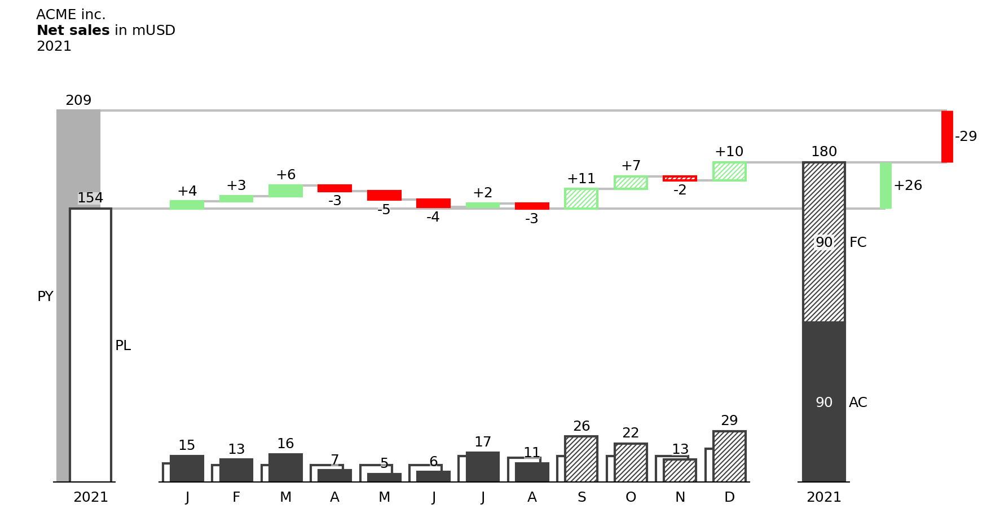
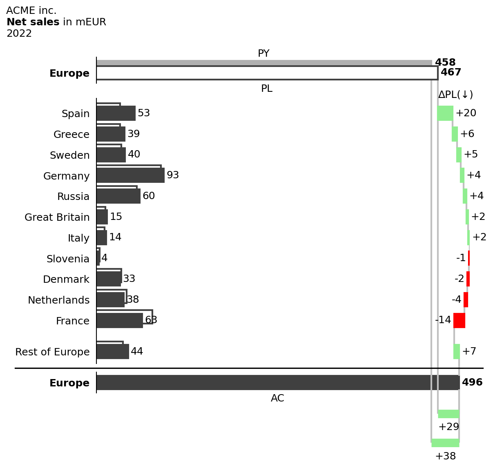

# clean_business_chart

Clean Business Chart for IBCS-inspired business charts in a Python Package

This Python Package can be tested with a Jupyter notebook online:

On Google Colab: https://colab.research.google.com/drive/1xJmfQI4sNNDRe5Olh5Hm96f5FxEJQ_Vo

Or DataCamp Workspace: https://app.datacamp.com/workspace/w/63ef8399-16af-49dd-8bcf-fff7b344ec73

Read my announcement on LinkedIn:
https://www.linkedin.com/pulse/clean-business-chart-first-mvp-python-package-charts-wuijtenburg/

Follow the public LinkedIn-group about Clean Business Chart:
https://www.linkedin.com/groups/12827987/

### Examples
#### Columnchart with waterfall (available)

#### Barchart with waterfall (available)

